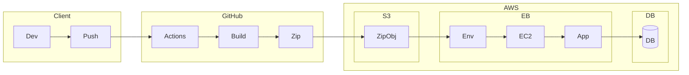
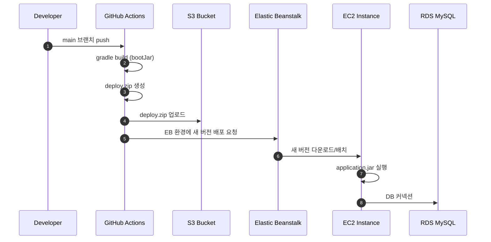

## Infra
🏗 전체 인프라 구조


🚀 배포 워크플로우

## CI/CD (Elastic Beanstalk + GitHub Actions)

### 1. Elastic Beanstalk 환경 생성

#### 1.1 RDS 생성
- 엔진: **MySQL 8.x**
- Public access: **Yes** (로컬 개발 환경에서 접속 필요)
- Inbound Rule:
    - MySQL(3306)
    - Source: **내 IP**

#### 1.2 EC2 Key Pair 생성
- EB가 EC2 인스턴스를 생성할 때 필요한 SSH 키
- AWS Console → **Key Pair → Create key pair**

#### 1.3 EC2 Role 생성
- 예시 이름: `aws-elasticbeanstalk-ec2-role`
- 필요한 정책:
  > AWSElasticBeanstalkWebTier  
  > AmazonEC2ContainerRegistryReadOnly  
  > CloudWatchAgentServerPolicy
- EB 환경 생성 시 자동 연결됨

#### 1.4 Elastic Beanstalk 앱 / 환경 생성
- Platform: **Java 17 / Java 21 (Corretto)**
- Type: 운영(Load Balanced) / 개발·테스트(Single Instance)
- EC2 Instance role: 위에서 생성한 Role 지정
- DB는 EB 내부가 아닌 **외부 RDS 사용**
- EB 기본 서버 포트: **5000**

---

### 2. GitHub Actions 연동

#### 2.1 AWS IAM Access Key 생성
- AWS Console → IAM → User → **Security credentials**
- **Create access key**  
  → `AWS_ACCESS_KEY_ID`, `AWS_SECRET_ACCESS_KEY` 발급  
  → GitHub Secrets에 저장 후 workflow 내에서  
  `${{ secrets.AWS_ACCESS_KEY_ID }}` 로 사용
- GitHub Repository → Settings → Secrets → **Actions**

#### 2.2 JAR 빌드 형태
- `*-plain.jar` 는 **의존성 미포함 → EB 실행 불가**
- 반드시 **Spring Boot fat jar(= boot jar)** 사용해야 함

---

### 3. GitHub Actions Workflow 작성
- .github/workflows/deploy.yml
``` yaml
name: Deploy to Elastic Beanstalk

on:
push:
branches: ["main"]

jobs:
deploy:
runs-on: ubuntu-latest

    steps:
      - name: Checkout
        uses: actions/checkout@v3

      - name: Set up JDK
        uses: actions/setup-java@v3
        with:
          distribution: 'corretto'
          java-version: '21'

      - name: Build with Gradle
        run: ./gradlew clean build -x test

      - name: Generate Deployment Package
        run: |
          mkdir -p deploy
          cp build/libs/*.jar deploy/application.jar
          cd deploy
          zip -r deploy.zip .

      - name: Deploy to EB
        uses: einaregilsson/beanstalk-deploy@v20
        with:
          aws_access_key: ${{ secrets.AWS_ACCESS_KEY_ID }}
          aws_secret_key: ${{ secrets.AWS_SECRET_ACCESS_KEY }}
          application_name: fc-board
          environment_name: fc-board-env
          region: ap-northeast-2
          version_label: github-$GITHUB_SHA
          deployment_package: deploy/deploy.zip
```
#### 4. 배포 흐름
- main 브랜치 push
- GitHub Actions 실행
- boot jar 생성
- jar → zip 패키징
- zip을 S3 업로드
- EB가 zip 받아서 EC2에 배포(jar 위치: /var/app/current/)
- EB run.sh에서 자동 실행 (java -jar)

✔ 요약
EB 생성 → RDS 연결 → EC2 Role 설정 → GitHub Secrets에 AWS 키 저장 → GitHub Actions로 jar 빌드 → EB로 zip 업로드 → EB가 EC2에 자동 배포

## Redis
### 1) Gradle 의존성 추가  
```gradle
implementation("org.springframework.boot:spring-boot-starter-data-redis")
```
### 2) application.yml 설정
RedisConfig에서 사용할 ${spring.cache.redis.host}, ${spring.cache.redis.port} 값 설정
```yaml
spring:
  cache:
    type: redis        # 캐시 저장소를 Redis로 사용
    redis:
      host: localhost # Redis 서버 주소
      port: 6379      # Redis 서버 포트
```
### 3) Docker로 Redis 실행
```bash
docker run -d --name redis-local -p 6379:6379 redis
```

### 4) RedisConfig 설정
```kotlin
@Configuration
class RedisConfig {

    @Value("\${spring.cache.redis.host}")
    lateinit var host: String // lateinit: runtime에 값 입력

    @Value("\${spring.cache.redis.port}")
    lateinit var port: String

    // Redis 서버와 연결해주는 커넥션 팩토리 생성
    @Bean
    fun redisConnectionFactory(): RedisConnectionFactory {
        return LettuceConnectionFactory(host, port.toInt())
    }

    // RedisTemplate은 Redis의 key-value 조작을 위한 핵심 객체
    @Bean
    fun redisTemplate(): RedisTemplate<String, Any> {
        val redisTemplate = RedisTemplate<String, Any>()
        redisTemplate.connectionFactory = redisConnectionFactory()

        // key와 value를 문자열 기반 직렬화로 설정
        redisTemplate.keySerializer = StringRedisSerializer()
        redisTemplate.valueSerializer = StringRedisSerializer()

        return redisTemplate
    }
}
```

## 쿼리 dsl 메서드
| QueryDSL 메서드     | 반환              | SQL                                |
| ---------------- | --------------- | ---------------------------------- |
| `fetch()`        | List<T>         | select * ...                       |
| `fetchOne()`     | T               | select * ... (1건 예상)               |
| `fetchFirst()`   | T               | select * ... limit 1               |
| `fetchCount()`   | Long            | select count(*) ...                |
| `fetchResults()` | QueryResults<T> | select * ... + select count(*) ... |

- 쿼리 dsl의 조금 더 모던한 사용법(강의와는 다른 사용방법)
```kotlin
@Repository
class CustomPostRepositoryImpl(
    private val queryFactory: JPAQueryFactory
) : CustomPostRepository {

    override fun findPageBy(pageRequest: Pageable, filter: PostSearchRequestDto): Page<Post> {

        // 콘텐츠 조회
        val content = queryFactory
            .selectFrom(post)
            .where(
                filter.title?.let { post.title.contains(it) },
                filter.createdBy?.let { post.createdBy.eq(it) }
            )
            .orderBy(post.createdAt.desc())
            .offset(pageRequest.offset)
            .limit(pageRequest.pageSize.toLong())
            .fetch()

        // 전체 개수 조회
        val total = queryFactory
            .select(post.count())
            .from(post)
            .where(
                filter.title?.let { post.title.contains(it) },
                filter.createdBy?.let { post.createdBy.eq(it) }
            )
            .fetchOne() ?: 0L

        return PageImpl(content, pageRequest, total)
    }
}
```
